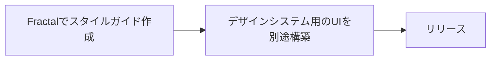

# Fractal hands-on

スタイルガイドツール "Fractal" のハンズオン資料です。

## Table of Contents

<!-- AUTO-GENERATED-CONTENT:START (TOC) -->
- [Fractalについて](#fractal%E3%81%AB%E3%81%A4%E3%81%84%E3%81%A6)
  * [特徴](#%E7%89%B9%E5%BE%B4)
  * [使い所](#%E4%BD%BF%E3%81%84%E6%89%80)
    + [デザインシステム構築に使う場合](#%E3%83%87%E3%82%B6%E3%82%A4%E3%83%B3%E3%82%B7%E3%82%B9%E3%83%86%E3%83%A0%E6%A7%8B%E7%AF%89%E3%81%AB%E4%BD%BF%E3%81%86%E5%A0%B4%E5%90%88)
- [Get started](#get-started)
  * [ディレクトリ構造](#%E3%83%87%E3%82%A3%E3%83%AC%E3%82%AF%E3%83%88%E3%83%AA%E6%A7%8B%E9%80%A0)
- [Lessons](#lessons)
<!-- AUTO-GENERATED-CONTENT:END -->

## Fractalについて

Fractal はnodejs製のスタイルガイドツールです。

🔗 https://fractal.build/

### 特徴

**🌞 Pros**

- スピーディーに作業できる
- 設定も（比較的）簡単！
- スタイルガイド内でコンポーネントを使いまわせる
- プロダクトとの依存関係を最小化できる
- すぐ導入できる・すぐ捨てれる

**☁ Cons**

- UIのデザイン変更が難しい
- UIの機能拡張は基本できない。
	- 配布されてるthemaプラグインをfolkすればできそう？
- **デザインシステム** として社外公開するには非力

### 使い所

- 新規プロダクトの開発初期
- 既存のプロダクトのスタイルガイド導入
- とりあえずスタイルガイドつくってみたい

#### デザインシステム構築に使う場合

初期 ~ 中期のスピード必要な時期にfractal導入。  
並行してデザインシステムの最終的なアウトプットを計画すると良さそう。



## Get started

fractalのコマンドを使う方法。  
グローバルにfractalをインストールしても良いのですが、
使い切りで良いのでnpxコマンド使います。

1. `npx @frctl/fractal new {{ your Project name }}`
1. `cd {{ Your project name }}`
1. `node_modules/.bin/@frctl/fractal/fractal start --sync`
1. http://localhost:3000 を開く

### ディレクトリ構造

<!-- AUTO-GENERATED-CONTENT:START (DIRTREE:dir=./sample-project/&depth=1) -->
```
sample-project/
├── assets/
├── components/
├── docs/
├── public/
├── fractal.js
├── package-lock.json
└── package.json
```
<!-- AUTO-GENERATED-CONTENT:END -->

- fractal.js: fractalの設定ファイル
- components/: htmlやcssなどコンポーネント管理
- docs/: ドキュメント
- public/: 公開ファイルのbuild先

## Lessons

- [lesson1](./lessons/01/README.md)
- [lesson2](./lessons/02/README.md)
- [lesson3](./lessons/03/README.md)

